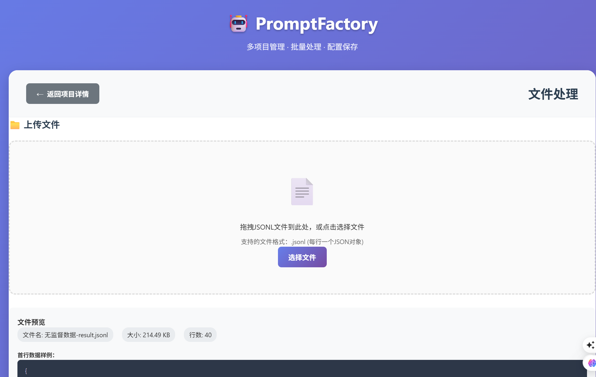
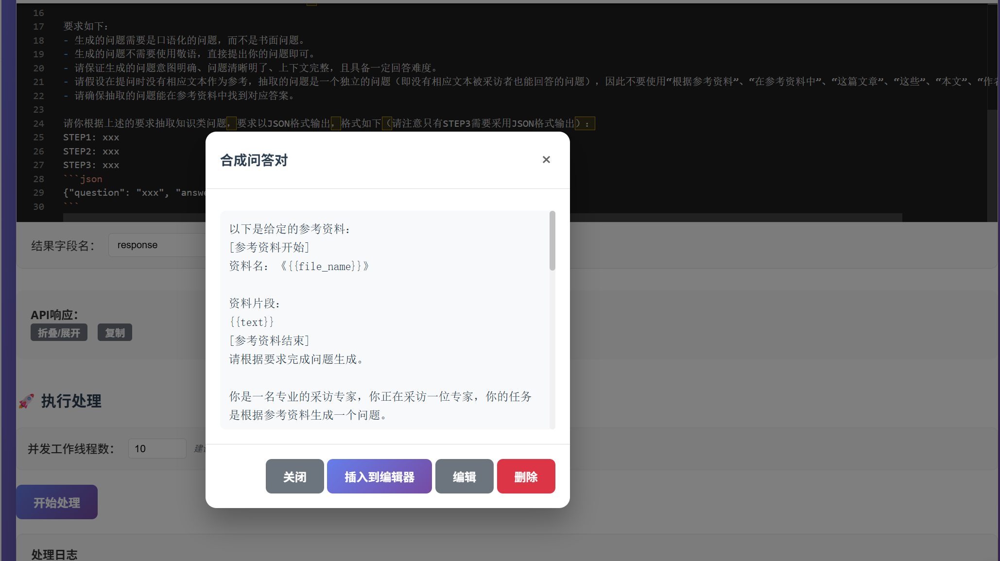

# PromptFactory (智问工坊)

> 一个基于Flask的可视化Web应用，支持多项目管理、动态提示词编写和大模型API批量调用。

## 项目截图

### 主界面


### 批量处理示例


## 功能特性

### 🚀 核心功能
- **多项目管理**: 创建、编辑、删除项目，每个项目独立的API配置和提示词模板
- **全局提示词模板库**: 创建和管理可复用的提示词模板，支持跨项目使用
- **动态提示词**: 支持变量替换 `{{变量名}}` 的提示词模板，智能变量识别
- **批量处理**: 高并发处理JSONL文件，支持自定义并发数（1-50线程）
- **实时进度跟踪**: 基于SSE的实时进度推送和日志显示
- **API配置管理**: 支持多种大模型API（OpenAI、自定义API等）
- **处理历史记录**: 完整的处理历史，包括成功/失败统计和错误日志
- **结果自动导出**: 处理完成后自动下载包含AI响应的JSONL文件

### 🛠 技术特性
- **并发处理**: 基于ThreadPoolExecutor的高性能并发API调用
- **智能错误处理**: 完善的错误捕获、重试机制和错误日志
- **实时进度反馈**: Server-Sent Events (SSE) 实现的实时进度推送
- **数据持久化**: SQLite数据库存储项目配置、模板和处理记录
- **响应式UI**: 现代化Web界面，支持拖拽上传和移动端适配
- **安全认证**: 支持多种API认证方式（Bearer Token、自定义Header等）

## 项目结构

```
server/
├── app.py                          # 主应用程序
├── requirements.txt                # Python依赖
├── README.md                       # 项目文档
├── projects.db                     # SQLite数据库（运行时创建）
├── data/
│   ├── prompt_templates.json       # 预置提示词模板
│   └── 无监督数据-result.jsonl     # 示例数据文件
├── static/
│   ├── app.js                      # 前端JavaScript
│   ├── styles.css                  # 样式文件
│   └── prompt_templates.json       # 前端模板配置
├── templates/
│   └── index.html                  # 主页面模板
└── imgs/
    ├── 1.png                       # 项目截图
    └── 2.png                       # 使用示例
```

## 快速开始

### 1. 环境要求
- Python 3.7+
- 现代浏览器（Chrome、Firefox、Safari、Edge）

### 2. 安装依赖

```bash
pip install -r requirements.txt
```

### 3. 启动应用

```bash
python app.py
```

应用将在 http://localhost:5001 上运行

### 4. 首次使用

1. 打开浏览器访问 http://localhost:5001
2. 点击"创建新项目"开始使用
3. 配置API参数后即可开始批量处理

## 详细使用指南

### 📁 项目管理

#### 创建新项目
1. 点击"创建新项目"按钮
2. 填写项目基本信息：
   - **项目名称**: 项目的显示名称
   - **项目描述**: 项目用途说明（可选）
3. 配置API参数：
   - **API地址**: 大模型API的完整URL
   - **模型名称**: 使用的模型名称
   - **API密钥**: 认证密钥
   - **温度**: 控制输出随机性（0-2，推荐0.3-0.7）
   - **最大生成长度**: 单次响应的最大token数
   - **超时时间**: 请求超时时间（秒）

#### 项目操作
- **编辑项目**: 点击项目卡片的编辑按钮
- **删除项目**: 点击删除按钮（需确认）
- **查看详情**: 点击项目卡片进入详情页面

### 📝 提示词模板管理

#### 全局模板库
- 在侧边栏访问"提示词模板"
- 创建可复用的模板，支持跨项目使用
- 预置了常用模板：基础问答、详细问答、翻译、合成问答对等

#### 动态提示词编写
1. 使用 `{{变量名}}` 格式引用数据字段
2. 系统自动识别上传文件中的可用变量
3. 点击变量标签快速插入
4. 支持实时预览和测试

### 📤 文件处理流程

#### 1. 上传数据文件
- 支持JSONL格式文件（每行一个JSON对象）
- 拖拽上传或点击选择文件
- 自动解析并显示文件预览
- 提取所有可用变量供模板使用

#### 2. 编写提示词模板
```
请根据以下信息回答：

用户问题：{{user_input}}
参考资料：{{text}}

请提供详细、准确的回答。
```

#### 3. 测试提示词
- 使用文件中的第一条数据进行测试
- 查看渲染后的提示词和API响应
- 确保模板正确后再进行批量处理

#### 4. 批量处理设置
- **并发线程数**: 根据API限制设置（建议5-20）
- **结果字段名**: 指定AI响应存储的字段名（默认"response"）
- **实时监控**: 查看处理进度和每条数据的处理结果

## API配置示例

### OpenAI API
```json
{
  "api_url": "https://api.openai.com/v1/chat/completions",
  "modelName": "gpt-4",
  "apiKey": "sk-your-openai-api-key",
  "temperature": 0.7,
  "maxTokens": 1000,
  "timeout": 30
}
```

### Azure OpenAI
```json
{
  "api_url": "https://your-resource.openai.azure.com/openai/deployments/your-deployment/chat/completions?api-version=2023-12-01-preview",
  "modelName": "gpt-4",
  "apiKey": "your-azure-api-key",
  "temperature": 0.3,
  "maxTokens": 16384,
  "timeout": 60
}
```

### 自定义API
```json
{
  "api_url": "https://your-api-endpoint.com/v1/chat/completions",
  "modelName": "your-model-name",
  "authorization": "Bearer your-custom-token",
  "temperature": 0.5,
  "maxTokens": 2048,
  "timeout": 45
}
```

## 数据格式说明

### 输入文件格式（JSONL）
每行必须是一个完整的JSON对象：

```jsonl
{"text": "人工智能的基本概念", "user_input": "什么是AI？", "category": "technology"}
{"text": "机器学习算法原理", "user_input": "机器学习如何工作？", "category": "education"}
{"text": "深度学习网络结构", "user_input": "神经网络是什么？", "category": "research"}
```

### 输出文件格式
处理后文件包含原数据 + AI响应：

```jsonl
{"text": "人工智能的基本概念", "user_input": "什么是AI？", "category": "technology", "response": "人工智能（AI）是计算机科学的一个分支..."}
{"text": "机器学习算法原理", "user_input": "机器学习如何工作？", "category": "education", "response": "机器学习是一种AI技术，通过算法让计算机..."}
{"text": "深度学习网络结构", "user_input": "神经网络是什么？", "category": "research", "response": "神经网络是模仿人脑神经元连接方式..."}
```

## 🐳 Docker 部署

### 在 WSL 中构建 ARM 镜像

#### 1. 环境准备

首先确保您的WSL环境中已安装Docker并启用了buildx：

```bash
# 检查Docker版本
docker --version

# 检查buildx是否可用
docker buildx version

# 创建并使用多平台构建器
docker buildx create --name multiarch --driver docker-container --use
docker buildx inspect --bootstrap
```

#### 2. 构建 ARM 镜像

```bash
# 构建 ARM64 镜像
docker build --platform linux/arm64 -t promptfactory:arm64 .

# 构建多平台镜像（ARM64 + AMD64）
docker buildx build --platform linux/arm64,linux/amd64 -t promptfactory:latest .

# 构建并推送到Docker Hub（可选）
docker buildx build --platform linux/arm64,linux/amd64 -t yourusername/promptfactory:latest --push .
```

#### 3. 拉取和运行镜像

如果您已经将镜像推送到镜像仓库，可以直接拉取：

```bash
# 拉取 ARM64 镜像
docker pull yourusername/promptfactory:latest

# 运行容器
docker run -d \
  --name promptfactory \
  -p 5001:5001 \
  -v $(pwd)/data:/app/data \
  yourusername/promptfactory:latest
```

#### 4. 本地运行（不推送到仓库）

```bash
# 构建并加载到本地Docker
docker buildx build --platform linux/arm64 -t promptfactory:arm64 --load .

# 运行容器
docker run -d \
  --name promptfactory \
  -p 5001:5001 \
  -v $(pwd)/data:/app/data \
  promptfactory:arm64
```

#### 5. Docker Compose 部署

创建 `docker-compose.yml` 文件：

```yaml
version: '3.8'

services:
  promptfactory:
    image: promptfactory:arm64
    container_name: promptfactory
    ports:
      - "5001:5001"
    volumes:
      - ./data:/app/data
      - promptfactory_db:/app
    environment:
      - FLASK_ENV=production
    restart: unless-stopped
    healthcheck:
      test: ["CMD", "curl", "-f", "http://localhost:5001/"]
      interval: 30s
      timeout: 10s
      retries: 3
      start_period: 40s

volumes:
  promptfactory_db:
```

启动服务：

```bash
# 启动服务
docker-compose up -d

# 查看日志
docker-compose logs -f

# 停止服务
docker-compose down
```

### 镜像拉取命令汇总

```bash
# 如果镜像已发布到Docker Hub
docker pull yourusername/promptfactory:latest

# 指定ARM64架构
docker pull --platform linux/arm64 yourusername/promptfactory:latest

# 运行容器（简单方式）
docker run -d -p 5001:5001 --name promptfactory yourusername/promptfactory:latest

# 运行容器（带数据卷挂载）
docker run -d \
  --name promptfactory \
  -p 5001:5001 \
  -v $(pwd)/data:/app/data \
  -v promptfactory_db:/app/projects.db \
  yourusername/promptfactory:latest
```

### 镜像特性

- ✅ **多架构支持**: ARM64 和 AMD64
- ✅ **安全性**: 非root用户运行
- ✅ **健康检查**: 自动监控应用状态
- ✅ **数据持久化**: 支持数据卷挂载
- ✅ **生产就绪**: 优化的Python环境

## 数据库结构

应用使用SQLite数据库存储以下信息：

### 表结构
- **projects**: 项目信息（ID、名称、描述、API配置、提示词模板）
- **processing_records**: 处理记录（文件名、处理统计、状态、时间）
- **prompt_templates**: 全局提示词模板（名称、描述、内容）

数据库文件：`projects.db`（首次运行时自动创建）

## 性能优化建议

### 并发设置
- **API限制考虑**: 根据您的API服务商限制设置合理的并发数
- **网络条件**: 网络较慢时降低并发数，避免超时
- **文件大小**: 大文件建议使用5-10个并发，小文件可增加到20-50

### 最佳实践
1. **测试先行**: 大批量处理前先用小样本测试
2. **错误监控**: 关注实时日志，及时发现问题
3. **网络稳定**: 确保网络连接稳定，避免处理中断
4. **备份数据**: 重要数据处理前请做好备份

## 故障排除

### 常见问题及解决方案

#### API调用失败
- **检查项**: API地址、密钥、网络连接
- **解决方案**: 使用"测试提示词"功能验证配置

#### 并发数过高导致限流
- **现象**: 大量请求返回429错误
- **解决方案**: 降低并发工作线程数

#### 文件格式错误
- **现象**: 上传后无法解析或出现JSON错误
- **解决方案**: 确保每行都是有效的JSON格式

#### 内存不足
- **现象**: 处理大文件时应用崩溃
- **解决方案**: 分批处理文件或增加系统内存

#### 处理中断
- **现象**: 处理过程中断开网页
- **解决方案**: 保持浏览器标签页开启，处理完成前不要关闭

## 部署说明

### 开发环境
```bash
# 克隆项目
git clone <repository-url>
cd server

# 安装依赖
pip install -r requirements.txt

# 启动开发服务器
python app.py
```

### 生产环境部署

#### 使用Gunicorn
```bash
# 安装Gunicorn
pip install gunicorn

# 启动生产服务器
gunicorn -w 4 -b 0.0.0.0:5001 app:app
```

#### 使用Docker
```dockerfile
FROM python:3.9-slim

WORKDIR /app

# 安装依赖
COPY requirements.txt .
RUN pip install --no-cache-dir -r requirements.txt

# 复制应用代码
COPY . .

# 暴露端口
EXPOSE 5001

# 启动命令
CMD ["python", "app.py"]
```

构建和运行：
```bash
docker build -t promptfactory .
docker run -p 5001:5001 -v $(pwd)/projects.db:/app/projects.db promptfactory
```

### Nginx反向代理配置
```nginx
server {
    listen 80;
    server_name your-domain.com;

    location / {
        proxy_pass http://127.0.0.1:5001;
        proxy_set_header Host $host;
        proxy_set_header X-Real-IP $remote_addr;
        proxy_set_header X-Forwarded-For $proxy_add_x_forwarded_for;
        
        # SSE支持
        proxy_buffering off;
        proxy_cache off;
    }
}
```

## 技术栈

- **后端**: Flask 2.3.3, SQLite3
- **前端**: 原生JavaScript, CSS3, HTML5
- **并发处理**: ThreadPoolExecutor
- **实时通信**: Server-Sent Events (SSE)
- **HTTP请求**: requests 2.31.0
- **跨域支持**: Flask-CORS 4.0.0

## 更新日志

### v1.0.0 (当前版本)
- ✅ 多项目管理系统
- ✅ 全局提示词模板库
- ✅ 动态提示词编辑器
- ✅ 高并发批量处理
- ✅ SSE实时进度推送
- ✅ 完整的错误处理机制
- ✅ 处理历史记录
- ✅ 拖拽文件上传
- ✅ 响应式UI设计

### 计划功能
- 🔄 API调用缓存机制
- 🔄 更多预置提示词模板
- 🔄 数据统计和可视化
- 🔄 用户权限管理
- 🔄 多语言支持

## 许可证

MIT License

## 作者

**Xixiang He**

---

如有问题或建议，欢迎提交Issue或Pull Request。 